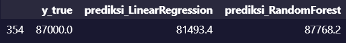

# Laporan Proyek Machine Learning Terapan - Muhammad Abdiel Firjatullah

## Domain Proyek

Topik yang diangkat dari proyek ini yaitu mengenai bidang ekonomi dan bisnis, di mana suatu perusahaan akan mengadakan perekrutan karyawan baru. Oleh karena itu, perusahaan ingin mengetahui kisaran gaji yang sesuai berdasarkan tahun pengalaman kerja calon karyawannya.

### Latar Belakang

Rekrutmen adalah proses mencari dan menyeleksi calon karyawan untuk mengisi posisi atau jabatan tertentu [[1]](https://majoo.id/solusi/detail/rekrutmen-adalah#:~:text=Rekrutmen%20adalah%20proses%20mencari%20dan,mudah%20mencari%20karyawan%20yang%20berkualitas.). Proses rekrutmen ini penting dalam menentukan baik tidaknya pelamar yang melamar pekerjaan pada suatu perusahaan. Salah satu variabel yang dapat menentukan baik tidaknya seorang karyawan adalah pengalaman kerja, semakin banyak pengalaman kerja seorang karyawan akan semakin baik juga kualitasnya. Mengutip salah satu e-Jurnal Riset Manajemen Prodi Manajemen Fakultas Ekonomi Unisma _"Pengalaman kerja merupakan pengalaman seorang karyawan yang telah memiliki jam kerja yang tinggi atau pengalaman yang lama dengan adanya pengalaman dapat memecahkan berbagai macam masalah, persoalan, penyelesaian tanggung jawab yang diberikan, sesuai dengan individu karyawan"_ [[2]](http://riset.unisma.ac.id/index.php/jrm/article/view/8261).

Dalam proyek ini perusahaan akan membuat beberapa model Machine Learning yang kemudian di evaluasi untuk membandingkan model mana yang hasil prediksinya paling baik lalu diharapkan dapat memprediksi kisaran gaji yang sesuai berdasarkan pengalaman kerja calon pelamarnya.

## Business Understanding

### Problem Statements

Berdasarkan latar belakang di atas, rincian masalahnya adalah sebagai berikut:

- Algoritma apa yang cocok untuk memprediksi kisaran gaji karyawan?
- Bagaimana cara menentukan hasil prediksi suatu Algoritma Machine Learning dapat dikatakan baik?

### Goals

Untuk menjawab pertanyaan di atas, maka akan dijabarkan sebagai berikut:

- Ada banyak algoritma yang dapat menyelesaikan masalah tersebut, namun di proyek ini akan menggunakan algoritma LinearRegression dan RandomForest.
- Melakukan evaluasi terhadap metrik dari masing-masing algoritma.

### Solution Statements

Solusi yang dapat dilakukan untuk memenuhi goals proyek ini diantaranya sebagai berikut:

- Membuat 2 model Machine Learning yaitu dengan algoritma LinearRegression dan RandomForest.

  - Konsep dari algoritma LinearRegression adalah memprediksi nilai dari y dengan mengetahui nilai x dan menemukan nilai m dan b yang errornya paling minimal [[3]](https://medium.com/@adiptamartulandi/belajar-machine-learning-simple-linear-regression-di-python-e82972695eaf).
      
    _y = mx + b + e_
      
    _Keterangan :_
     
    _y = dependent variable_
     
    _m = slope dari garis (persamaan diatas merupakan sebuah garis)_
     
    _x = independent variable_
     
    _b = intercept_
     
    _e = error_
      
    Adapun kelebihan dari metode ini yakni metode ini mampu digunakan untuk memprediksi nilai yang ada pada masa depan jika hubungan antara variabel independen dan dependen memiliki hubungan linear. Kekurangan dari metode ini yaitu pada keadaan sesungguhnya jarang sekali variabel dependen dan independen menunjukkan hubungan yang jelas [[4]](https://caraguna.com/apa-itu-linear-regression-dalam-machine-learning/).
       
    

  - Konsep dari algoritma RandomForest yaitu model prediksi yang terdiri dari beberapa model dan bekerja secara bersama-sama. Kelebihan dari metode ini yakni jika dataset berjumlah banyak maka RandomForest akan bekerja secara efisien.
      
    

- Perkiraan gaji adalah tujuan yang ingin dicapai. Seperti yang kita tahu, perkiraan gaji merupakan variabel kontinu. Saat membuat prediksi variabel kontinu artinya ini merupakan permasalahan regresi. Untuk kasus regresi seperti ini akan gunakan metrik Mean Squared Error (MSE).Secara umum, metrik ini mengukur seberapa jauh hasil prediksi dengan nilai yang sebenarnya. Oleh karena itu nantinya masing-masing model akan di evaluasi yang kemudian memilih algoritma yang nilai metriknya paling baik.

## Data Understanding

Dataset yang digunakan pada proyek kali ini dibuat oleh [RubyDoby](https://www.kaggle.com/rubydoby) yang di upload ke [Kaggle](https://www.kaggle.com/) pada Januari 2022. Sumber dataset: [Years of experience and employees salary](https://www.kaggle.com/datasets/rubydoby/years-of-experience-and-employees-salary).

Pada berkas yang diunduh pada [link tersebut](https://www.kaggle.com/datasets/rubydoby/years-of-experience-and-employees-salary) yaitu [employee_salaries.csv](https://www.kaggle.com/datasets/rubydoby/years-of-experience-and-employees-salary?select=employee_salaries.csv) terdapat 1500 baris dan 2 kolom.

### Variabel-variabel pada Years of Experience and Employee Salary Dataset adalah sebagai berikut:

- Years of Experience: merupakan total tahun pengalaman kerja.
- Salary: merupakan total gaji karyawan per tahun dalam kurs dollar.

### Exploratory Data Analysis - Univariate Analysis

Dari hasil visualisasi di atas dapat disimpulkan bahwa:

- Sebagian besar sampel Years of experience berada di kisaran 8-14 tahun.
- Sebagian besar sampel Salary berada di kisaran 86000-90000.

### Exploratory Data Analysis - Multivariate Analysis

Dari hasil visualisasi data di atas dapat disimpulkan bahwa:

- Pola sebaran data pada grafik pairplot di atas memiliki korelasi posistif.  

Berdasarkan visualisasi heatmap di atas dapat disimpulkan bahwa:

- Variabel Years of experience berkorelasi positif dengan variabel Salary, skornya yaitu 0.8.

## Data Preparation

Berikut merupakan tahapan-tahapan dalam Data Preparation:

- Melakukan Split Data, dataset yang ada dibagi menjadi 2 bagian yaitu data latih dan data uji dengan rasio 80:10. Proses ini dilakukan dengan menggunakan modul [train_test_split](https://scikit-learn.org/stable/modules/generated/sklearn.model_selection.train_test_split.html) dari library scikit-learn.
- Melakukan standarisasi pada data latih dengan menggunakan StandardScaler dari library sckit-learn.

## Modeling

Setelah melakukan data preparation data yang sudah siap akan digunakan untuk membuat model, kali ini akan dibuat 2 model sebagai perbandingan.

- Membuat model dengan menggunakan algoritma [LinearRegression](https://scikit-learn.org/stable/modules/generated/sklearn.linear_model.LinearRegression.html), alasan menggunakan algoritma ini karena ini merupakan algortima yang umum untuk menyelesaikan permasalahan regresi, kelebihan dari algoritma ini yaitu mudah dipahami.
- Membuat model dengan menggunakan algoritma [RandomForest](https://scikit-learn.org/stable/modules/generated/sklearn.ensemble.RandomForestRegressor.html), kelebihan dari menggunakan algoritma ini yaitu dapat mengatasi noise dan missing value serta dapat mengatasi data dalam jumlah yang besar, adapun kekurangan pada algoritma Random Forest yaitu interpretasi yang sulit dan membutuhkan tuning model yang tepat untuk data [[5]](https://eprints.umm.ac.id/39299/3/BAB%202.pdf).

## Evaluation

Proses evaluasi model pada proyek ini menggunakan metrik Mean Squared Error yang menghitung jumlah selisih kuadrat rata-rata nilai sebenarnya dengan nilai prediksi [[6]](https://www.dicoding.com/academies/319/tutorials/18595).

MSE didefinisikan dalam persamaan berikut:

_Keterangan:  
N = jumlah dataset  
yi = nilai sebenarnya  
y_pred = nilai prediksi_

### Model dengan Algoritma LinearRegression

Seperti terlihat pada gambar, model yang dibuat menggunakan algortima LinearRegression memiliki nilai MSE yang sangat tinggi hingga mencapai 113458.095232 pada saat training dan 127004.94334 pada saat test, hal ini menunjukkan algoritma ini kurang baik untuk melakukan prediksi.

Pada proses pengujian pun dapat terlihat hasil prediksi tidak akurat dengan nilai sebenarnya.

### Model dengan Algoritma RandomForest

Seperti terlihat pada gambar, saat dibandingkan dengan algoritma LinearRegression terlihat algortima RandomForest memiliki nilai MSE yang lebih rendah yaitu 13235.129443 pada saat training dan 15922.675464 pada saat test, hal ini menunjukkan algoritma RandomForest lebih baik untuk melakukan prediksi dibanding LinearRegression.

Pada proses pengujian dapat terlihat hasil prediksi dari model yang menggunakan RandomForest lebih akurat dengan nilai sebenarnya. Oleh karena itu algoritma ini yang akan dipilih sebagai model utama untuk memprediksi kisaran gaji karyawan.

## Referensi

[1] https://majoo.id/solusi/detail/rekrutmen-adalah#:~:text=Rekrutmen%20adalah%20proses%20mencari%20dan,mudah%20mencari%20karyawan%20yang%20berkualitas.

[2] http://riset.unisma.ac.id/index.php/jrm/article/view/8261

[3] https://medium.com/@adiptamartulandi/belajar-machine-learning-simple-linear-regression-di-python-e82972695eaf

[4] https://caraguna.com/apa-itu-linear-regression-dalam-machine-learning/

[5] https://eprints.umm.ac.id/39299/3/BAB%202.pdf

[6] https://www.dicoding.com/academies/319/tutorials/18595
